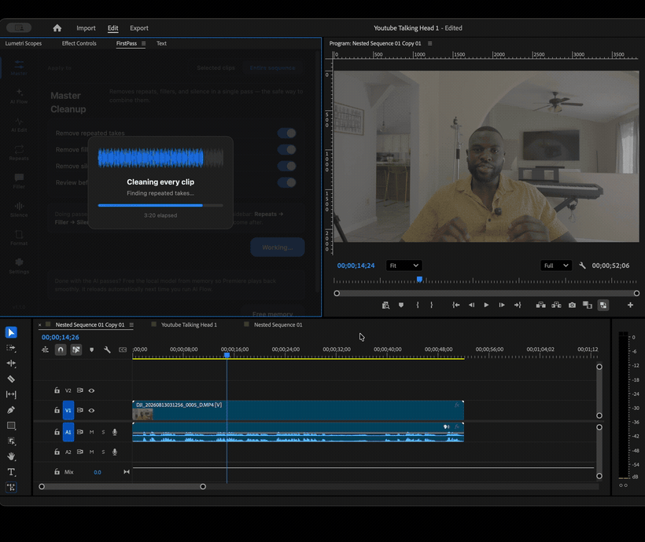

# FirstPass

**Local AI editing for Adobe Premiere Pro.** It removes dead takes, filler words and
silence — then reorders your story and adds the punch-ins.

Everything runs on your Mac. No account, no API key, no subscription, and your footage
never leaves the machine.

<!-- TODO: replace with demo.gif — raw take on the left, finished timeline on the right -->
<!--  -->

```bash
git clone https://github.com/Johnsonngandjui/firstpass.git
cd firstpass
./install.sh
```

---

## What it does

FirstPass is a Premiere panel backed by a helper that runs locally: speech-to-text via
CrisperWhisper, and a 14B language model via Ollama.

| | |
|---|---|
| **Master** | One pass: cut repeated takes, filler words and silence together. Review before anything is applied. |
| **AI Flow** | Reads every clip's transcript, drops dead takes, groups topics, and **reorders your timeline** into a story arc. Suggests a hook, b-roll and pacing. |
| **AI Edit** | Plans a camera move per shot — pushes, punch-ins, holds — and writes **real Motion/Scale keyframes**. |
| **Repeats** | Finds re-spoken lines and keeps the good take. |
| **Filler** | um, uh, you know, basically… — editable word list. |
| **Silence** | Threshold + minimum duration, with padding and smart dead-air detection. |
| **Format** | Resize a sequence to Reels/TikTok, YouTube, square — in place or as a copy. |

Every cut pass opens a word-level transcript first. Click any word to keep or cut it,
and you see the estimated time saved before you commit.

---

## Requirements

| | |
|---|---|
| **macOS** | Apple Silicon strongly recommended. Intel works but is slow — no Metal acceleration. |
| **Premiere Pro** | 2026 (v25.6 or newer) — FirstPass uses the UXP editing API that older builds don't expose. |
| **RAM** | 16 GB realistically. The 14B model wants ~10 GB while it's thinking. |
| **Disk** | ~12 GB of one-time model downloads. |
| **Python** | 3.10+. macOS ships 3.9, so `brew install python@3.12` if you don't have a newer one — `install.sh` will tell you. |

Windows is not supported yet.

---

## Installing

`./install.sh` handles the whole local stack: Ollama and the language model, a Python
virtualenv, the speech model, and a background helper that starts and stops with Premiere.
It's safe to re-run — every step is skipped if it's already done.

Then load the panel by hand (Adobe requires this):

1. **Open Premiere Pro first**
2. Install **UXP Developer Tool** from Creative Cloud Desktop
3. UXP Developer Tool → **Add Plugin** → select `plugin/manifest.json`
4. Click **Load**
5. In Premiere: **Window → UXP Plugins → FirstPass**

The first install downloads roughly 12 GB of models. It's a one-time cost.

---

## Before you run it on real work

**FirstPass edits your active sequence in place.** It does not create a copy by default.

- `Cmd+Z` undoes any pass.
- The Repeats and Silence tabs have a **Backup sequence first** toggle.
- On anything you can't afford to lose, duplicate the sequence before you start.

FirstPass reads **Video Track 1**. Media must be reachable from this machine — if your
footage lives on a NAS, mount it before analyzing.

---

## What it can't do

Being straight about the edges, because they're the difference between "this is broken"
and "this isn't for me yet":

- **macOS only.** No Windows build.
- **Talking-head footage.** It's built for one or more people speaking to camera. It
  won't do anything sensible with music videos or dialogue scenes with overlapping speakers.
- **Each clip is transcribed separately**, so a timeline of many distinct source files takes
  proportionally longer.
- **AI Flow's pacing notes and continuity warnings are advisory** — they're shown for you to
  act on, not applied automatically.
- **The AI needs headroom.** On a 16 GB machine, quit Chrome before running AI Flow. Use
  **Free memory** on the Master tab to unload the model when you're done and want playback back.
- Transcription quality sets the ceiling. Heavy accents, cross-talk or bad audio degrade
  every downstream pass.

---

## Troubleshooting

**Red dot / "Helper not running"**
The helper only runs while Premiere is open. If it's still red, check
`helper/firstpass-helper.log`, or start it manually:
`helper/firstpass-env/bin/python3 helper/server.py`

**"No clips found on video track 1"**
FirstPass reads V1. Move your footage there.

**AI Flow says the model isn't ready**
Ollama isn't running or the model isn't pulled:
`ollama serve` then `ollama pull qwen2.5:14b-instruct`

**Transcription is very slow**
Expected on Intel or on CPU. Apple Silicon uses Metal and is dramatically faster.

**Something else**
Settings → **Copy diagnostics**, then open an issue and paste the result. It contains
versions and hardware only — no filenames, footage paths or transcript text.

---

## How it works

Three processes:

```
Premiere UXP panel  ──HTTP──▶  local helper (:7742)  ──HTTP──▶  Ollama (:11434)
plugin/                        helper/server.py                 qwen2.5:14b-instruct
                               CrisperWhisper
```

The panel never talks to the network beyond `localhost`. The only two outbound URLs in
the codebase are `localhost:7742` and `localhost:11434` — everything else is on disk.
Models are downloaded once, at install time.

```
firstpass/
├── install.sh
├── plugin/
│   ├── manifest.json    ← UXP manifest
│   ├── index.html       ← the panel UI (styles are inline)
│   └── main.js          ← Premiere API wiring + helper calls
└── helper/
    ├── server.py        ← FastAPI: transcription, silence/filler/repeat detection
    ├── ai_flow.py       ← story + cinematography planning prompts
    └── premiere-watch.sh ← starts/stops the helper with Premiere
```

---

## License

[FSL-1.1-ALv2](LICENSE.md) — free to use, including on paid client work. You just can't
repackage it as a competing product. Converts to Apache 2.0 two years after each release.
